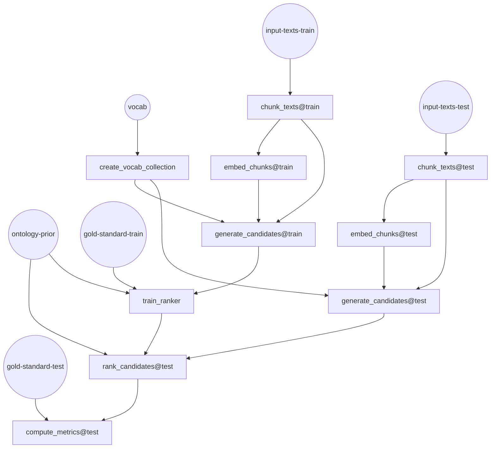

# Embedding Based Matching for Automated Subject Indexing

This repository implements a prototype of a simple algorithm for matching subjects with
sentence transformer embeddings. The idea is quite simple: Your target vocabulary is
vectorized with a sentence transformer model, the embeddings are stored in a vector
storage, enabling fast search across these embeddings with the Hierarchical Navigable
Small World Algorithm. This enables fast semantic (embedding based) search across the 
vocaublary, even for extrem large vocabularies with many synonyms.

An input text to be indexed with terms from this vocabulary is embedded with the same
sentence transformer model, and sent as a query to the vector storage, resulting in
subject suggestions with embeddings that are close to the query. 
Longer input texts can be chunked, resulting in multiple queries. 

Finally, a ranker model is trained, that reranks the subject suggestions, using some 
numerical features collected during the matching process. 


## Why embedding based matching

Existing subject indexing methods are roughly categorized into lexical matching algortihms and statistical learning algorithms. Lexical matching algorithms search for occurences of subjects from the controlled vocabulary over a given input text on the basis of their string representation. Statistical learning tries to learn patterns between input texts and gold standard annotations from large training corpora. 

Statistical learning can only predict subjects that have occured in the gold standard used for training. It is uncapable of zero shot predictions. Lexical matching can find any subjects that are part of the vocabulary. Unfortunately, lexical matching often produces a large amount of false positives, as matching input texts and vocabulary solely on their string representation does not capture any semantic context. 

The idea of embedding based matching is to enhance lexcial matching with the power of sentence transformer embeddings. These embeddings can capture the semantic context of the input text and allow a vector based matching
that does not rely on the string representation. 

Benefits of Embedding Based Matching:

  * strong zero shot capabilities
  * handling of synonyms and context

Disadvantages:

  * creating embeddings for longer input texts with many chunks can be computationally expensive
  * no generelization capabilities: statisticl learning methods can learn the usage of a vocabulary from large amounts of training data and therefore learn associations between patterns in input texts and vocabulary items that are beyond lexical matching or embedding similarity. Lexical matching and embedding based matching will always stay close to text.  

## Ranker model

The ranker model copies the idea taken from lexical matching Algorithms like MLLM or Maui, that subject candidates
can be ranked based on additional context information, e.g.

  * position of the match in text
	* overall usage frequency of a label in the vocabulary (we call this ontology prior)
	* number of occurence in a text
	* similarity score of the text and label embeddings
	* pref-Label or alt-Label tags in the SKOS Vocabulary

These are numerical features that can be used to train a binary classifier. Given a
few hundred examples with gold standard labels, the ranker is trained to 
predict if a suggested candidate label is indeed a match, based on the
numerical features collected during the matching process.  In contrast to
the complex extreme multi label classification problem, this is a a mutch simpler
problem to train a classifier for, as the selection of features that the binary classifier 
is trained on, does not depend on the particular label. 

Our ranker model is implemented using the `xgboost` library.

## What embedding model to choose

Our code allows the usage of a wide variety of sentence transformer models, using the
`transformers` library. However, generating embeddings for longer texts with many
chunks can be costly, which is why we recommend using [Jina AI Embeddings](https://huggingface.co/jinaai/jina-embeddings-v3). These implement a technique known as Matryoshka Embedding that allow you to
flexibly choose the dimension of your embedding vectors, to find your own 
cost-performance trade off. 


# Installation

```
conda create env --file environment.yaml
conda activate ebm4subjects
pip install weaviate-client==4.9.3
```

The program assumes that you have a local weaviate instance running, that you can connect to with the weaviate-client library:

```python
import weaviate

client = weaviate.connect_to_local()
if not client.is_ready():
      sys.exit("Weaviate client is not ready. Exiting...")
```

# DVC workflow

The repository is implemented as a [DVC](dvc.org) workflow. 

## Dependency of Stages

The DVC workflow has the following stages

* chunk_texts
* embed_chunks
* index_candidates
* train_ranker
* rank_candidates
* Optional: compute_metrics

The following DAG depicts how these stages depend on each other, circles representing the essential input required:



## Parameters

### Embedding Parameters

| Parameter Name | Description | Default Value |
|----------------|-------------|---------------|
| `embedding_model` | The sentence transformer model used for generating embeddings. | `jinaai/jina-embeddings-v3` |
| `embedding_dim` | The dimensionality of the Jina-AI Embeddings (not supported on other models) |

### Chunking parameters

| `chunk_size` | The size of text chunks for embedding. | `512` |
| `max_docs` | A limit on how many documents of a given text corpus are to be processed | `30000` |
| `max_chunks` | The maximum number of chunks that are created for each document. This can be an effective parameter to reduce computation time | `600` | 