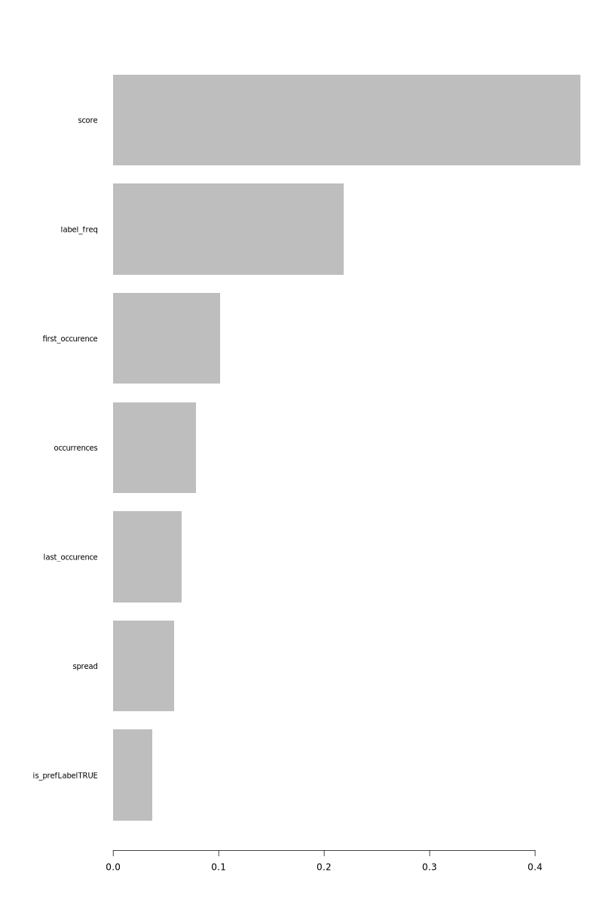
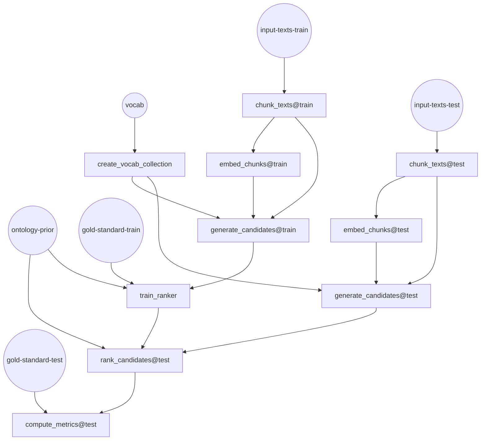

# Embedding Based Matching for Automated Subject Indexing

This repository implements a prototype of a simple algorithm for matching subjects with
sentence transformer embeddings. The idea is quite simple: Your target vocabulary is
vectorized with a sentence transformer model, the embeddings are stored in a vector
storage, enabling fast search across these embeddings with the Hierarchical Navigable
Small World Algorithm. This enables fast semantic (embedding based) search across the 
vocaublary, even for extrem large vocabularies with many synonyms.

An input text to be indexed with terms from this vocabulary is embedded with the same
sentence transformer model, and sent as a query to the vector storage, resulting in
subject candidates with embeddings that are close to the query. 
Longer input texts can be chunked, resulting in multiple queries. 

Finally, a ranker model is trained, that reranks the subject candidates, using some 
numerical features collected during the matching process. 


This design borrows a lot of ideas from lexical matching like Maui [1], Kea [2] and particularly
[Annifs](https://annif.org/) implementation in the [MLLM-Backend](https://github.com/NatLibFi/Annif/wiki/Backend%3A-MLLM) (Maui Like Lexical Matching).  

[1] Medelyan, O., Frank, E., & Witten, I. H. (2009). Human-competitive tagging using automatic keyphrase extraction. ACL and AFNLP, 6–7. https://doi.org/10.5555/3454287.3454810

[2] Frank, E., Paynter, G. W., Witten, I. H., Gutwin, C., & Nevill-Manning, C. G. (1999). Domain-Specific Keyphrase Extraction. Proceedings of the 16 Th International Joint Conference on Artifical Intelligence (IJCAI99), 668–673.


## Why embedding based matching

Existing subject indexing methods are roughly categorized into lexical matching algortihms and statistical learning algorithms. Lexical matching algorithms search for occurences of subjects from the controlled vocabulary over a given input text on the basis of their string representation. Statistical learning tries to learn patterns between input texts and gold standard annotations from large training corpora. 

Statistical learning can only predict subjects that have occured in the gold standard used for training. It is uncapable of zero shot predictions. Lexical matching can find any subjects that are part of the vocabulary. Unfortunately, lexical matching often produces a large amount of false positives, as matching input texts and vocabulary solely on their string representation does not capture any semantic context. 

The idea of embedding based matching is to enhance lexcial matching with the power of sentence transformer embeddings. These embeddings can capture the semantic context of the input text and allow a vector based matching
that does not rely (solely) on the string representation. 

Benefits of Embedding Based Matching:

  * strong zero shot capabilities
  * handling of synonyms and context

Disadvantages:

  * creating embeddings for longer input texts with many chunks can be computationally expensive
  * no generelization capabilities: statisticl learning methods can learn the usage of a vocabulary from large amounts of training data and therefore learn associations between patterns in input texts and vocabulary items that are beyond lexical matching or embedding similarity. Lexical matching and embedding based matching will always stay close to text.  

## Ranker model

The ranker model copies the idea taken from lexical matching Algorithms like MLLM or Maui, that subject candidates
can be ranked based on additional context information, e.g.

  * position of the match in text (`first_occurence`, `last_occurence`, `spread`)
	* overall usage frequency of a label in the vocabulary (we call this ontology prior) `label_freq`
	* number of occurence in a text `occurences`
	* sum of the similarity scores of all matches between a text chunk's embeddings and label embeddings `scores`
	* pref-Label or alt-Label tags in the SKOS Vocabulary `is_PrefLabelTRUE`

These are numerical features that can be used to train a binary classifier. Given a
few hundred examples with gold standard labels, the ranker is trained to 
predict if a suggested candidate label is indeed a match, based on the
numerical features collected during the matching process.  In contrast to
the complex extreme multi label classification problem, this is a a much simpler
problem to train a classifier for, as the selection of features that the binary classifier 
is trained on, does not depend on the particular label. 

Our ranker model is implemented using the [xgboost](https://xgboost.readthedocs.io/en/latest/index.html) library.

The following plot shows a variable importance plot of the xgboost Ranker-Model:



## Embedding model

Our code uses [Jina AI Embeddings](https://huggingface.co/jinaai/jina-embeddings-v3). These implement a technique known as Matryoshka Embedding that allows you to
flexibly choose the dimension of your embedding vectors, to find your own 
cost-performance trade off. 

In particular, we use assymetric embeddings finetuned for retrieval: Embeddings of task `retrieval.query` for embedding the vocab and embeddings of task `retrieval.passage` for embedding the text chunks. 


# Installation

```
conda env create --file environment.yaml
conda activate ebm4subjects
```

The program assumes that you have a local weaviate instance running, that you can connect to with the weaviate-client library:

```python
import weaviate

client = weaviate.connect_to_local()
if not client.is_ready():
      sys.exit("Weaviate client is not ready. Exiting...")
```

# Data format structure

## Vocabulary

This should be a SKOS `.ttl` file. In this example we use a subset of subjects headings from the integrated authority file (GND).

```
.
├── vocab
│   ├── subjects.ttl
|   ├── subjects-ontology-prior.arrow
```
The ontology prior should be feather file with expected columns `label_id` (str) and `label_freq` (int)

| label_id  | label_freq | 
|------------|----------------|
|  000002917 |          5  |
|  000002992 |           4  |
| ... | ... |


## Text corpora

The pipeline expects the annif short document format. 

```
.
├── corpora/ftoa/
│   ├── train.tsv.gz
│   ├── validate.tsv.gz
│   └── test.tsv.gz
```

# DVC workflow

The repository is implemented as a [DVC](dvc.org) workflow. 

## Dependency of Stages

The DVC workflow has the following stages

* create_vocab_collection
* chunk_texts
* embed_chunks
* generate_candidates
* train_ranker
* rank_candidates
* Optional: compute_metrics

The following DAG depicts how these stages depend on each other, circles representing the essential input required:



## Parameters

### Embedding Parameters

| Parameter Name | Description | Default Value |
|----------------|-------------|---------------|
| `embedding_model` | The sentence transformer model used for generating embeddings. | `jinaai/jina-embeddings-v3` |
| `embedding_dim` | The dimensionality of the Jina-AI Embeddings (not supported on other models) | `1024` |

### Vocab configuration

| Parameter Name | Description | Default Value |
|----------------|-------------|---------------|
| `phrase` | A default phrase that is prefixed to the vocab items before embedding. This could be something like "A good subject heading for this text is: " For some embedding models this can help  | `""` |
| `use_altLabels` | Also embed alternative Labels from the SKOS collection. | `true` |

### Chunking parameters

| Parameter Name | Description | Default Value |
|----------------|-------------|---------------|
| `chunk_size` | The size of text chunks intended for embedding. Multiple sentences will be concatenated until `chunk_size` is overstepped. Then a new chunk will be created. Shorter chunks create candidates closer to the text, but will also increase the number of chunks, and hence the computational costs | `512` |
| `max_docs` | A limit on how many documents of a given text corpus are to be processed | `30000` |
| `max_chunks` | The maximum number of chunks that are created for each document. This can be an effective parameter to reduce computation time | `600` |
| `max_sentences_per_doc` | An intermediate step of the chunking process is splitting the text into sentences. This avoids chunking the document at unnatural splitting points. `max_sentences_per_doc` can be used to shorten texts, based on the number of sentecnes (rather then chracdter counts). |

### Parameters for Hybrid Search

| Parameter Name | Description | Default Value |
|----------------|-------------|---------------|
| `alpha`        | Balance vector search and classical bm25. `alpha=0` is classical bm25, i.e. almost like lexcial matching. `alpha=1` is pure vector search, no reliance on text representation.  | `0.625` |
| `top_k`        | How many candidates per Text will be generated. Increase to boost recall, decrease for higher precision  | `100` |
| `n_hits` | How many candidates per chunk will be retrieved from the vocab? Increase to boost recall, decrease for higher precision | `20 ` |
| `n_jobs` | How many parallel processes? | `20` | 
